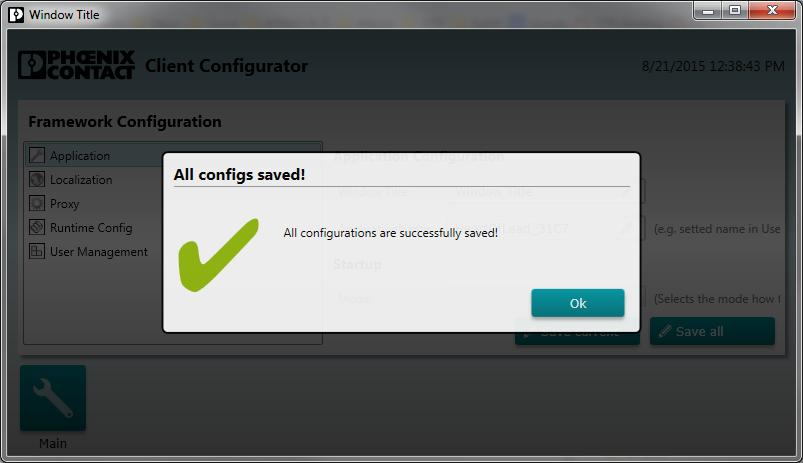

# Modal Dialogs

The DialogManager manages multiple modal dialogs for the default shell. You can show MessageBoxes or custom views.

````cs
public interface IDialogManager
{
    void ShowDialog(IScreen dialogViewModel);
    void ShowDialog(IScreen dialogViewModel, Action<IScreen> callback);

    void ShowMessageBox(string message, string title, MessageBoxOptions options, MessageBoxImage image, Action<IMessageBox> callback);
    void ShowMessageBox(string message, string title, MessageBoxOptions options, MessageBoxImage image);

    void ShowMessageBox(string message, string title, Action<IMessageBox> callback);
    void ShowMessageBox(string message, string title);
}
````

Every ClientModule container have a default implementation of the manager. Just inject it.

## MessageBoxes

````cs
DialogManager.ShowMessageBox("This is my TestMessage", "This is my Title", Callback);
````

## Custom Modal Dialogs

````cs
DialogManager.ShowDialog(new DefaultAboutViewModel());
````

### Sample


